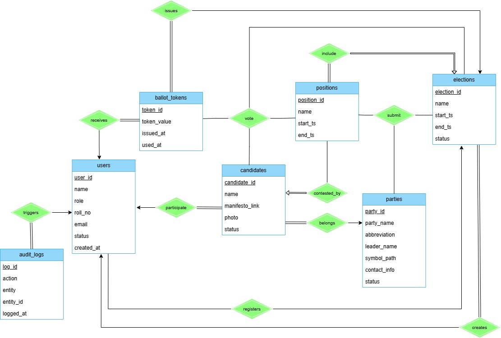
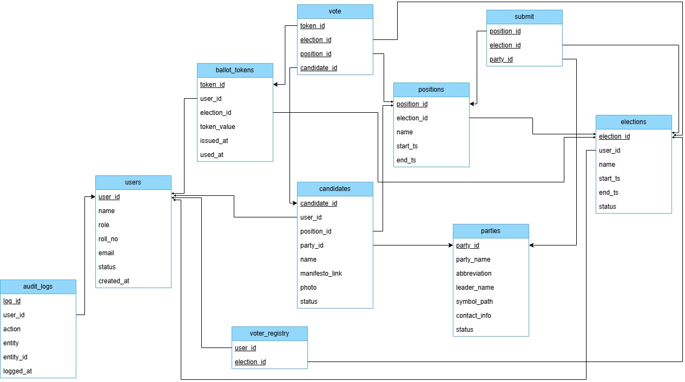

# Campus Online Voting System (COVS)

Database design for a secure, auditable **campus election system** built in MySQL.  
The focus of this project is on **schema design**, **constraints**, **triggers**, and **querying election data**, not on a UI.

---

## Overview

COVS models the end-to-end flow of a student election:

- admins create elections and positions  
- parties register and nominate candidates  
- students are registered as voters  
- unique ballot tokens are issued  
- votes are cast and logged  
- audit logs capture every critical action

---

## Data Model

### ER Diagram

### Relational Schema

**Core tables (high-level):**

- `users` – students/admins with roles and status  
- `elections`, `positions` – elections and the posts being contested  
- `parties`, `candidates`, `submit` – parties and their nominated candidates  
- `voter_registry` – which user can vote in which election  
- `ballot_tokens` – one unique token per voter per election  
- `vote` – actual votes cast (linked via token, not directly to user)  
- `audit_logs` – who did what, on which entity, and when

---

## Key Features

- **Role-based structure** – separates admins and student voters.
- **Token-based voting** – each voter gets a single use ballot token per election.
- **Strict referential integrity** – primary/foreign keys and unique constraints.
- **Automatic auditing via triggers**:
  - user registration
  - election creation
  - candidate nomination
  - ballot token issuance
  - vote casting
- **Rich reporting queries**:
  - voter registration checks
  - votes per candidate/position
  - winners per position
  - turnout statistics
  - logs filtered by action/user

---

